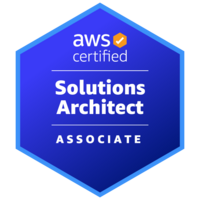
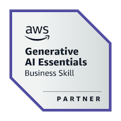

- 👋 Hi, I’m @jaradtke-aws (James Radtke).  This is my work-related Github account and my personal contributions.
- 👀 I’m interested in ... Hybrid Cloud, Containers/Kubernetes
- 🌱 I’m currently working on... 
 -[EKS Anywhere](https://github.com/aws/eks-anywhere) 
 - [EKS Workshop](https://github.com/aws-samples/eks-workshop-v2)
 - [Data on EKS](https://github.com/jaradtke-aws/data-on-eks)
- 💞️ I’m looking to collaborate on ... "how-to content", podcasts, etc...
- 📫 How to reach me ... jaradtke \<at> amazon 

| Service / Username       | URL |
|:-------------------------|:------------------------------------------|
| LinkedIn                 | https://www.linkedin.com/in/to-the-cloud/ |
| Credly                   | https://credly.com/users/cloudxabide      |

 

 

 

# Best Practices (Universal Recommendations)
* Do NOT use the "Root Account" for anything other than creating new IAM accounts.
* Use MFA.  Always. (where possible)
* Cloud9 is a great IDE which is integrated to AWS Services and does not require management of AWS access keys.
* Create and use a ["tagging strategy"](https://docs.aws.amazon.com/general/latest/gr/aws_tagging.html) of some sort.

<!---
jaradtke-aws/jaradtke-aws is a ✨ special ✨ repository because its `README.md` (this file) appears on your GitHub profile.
You can click the Preview link to take a look at your changes.
--->
